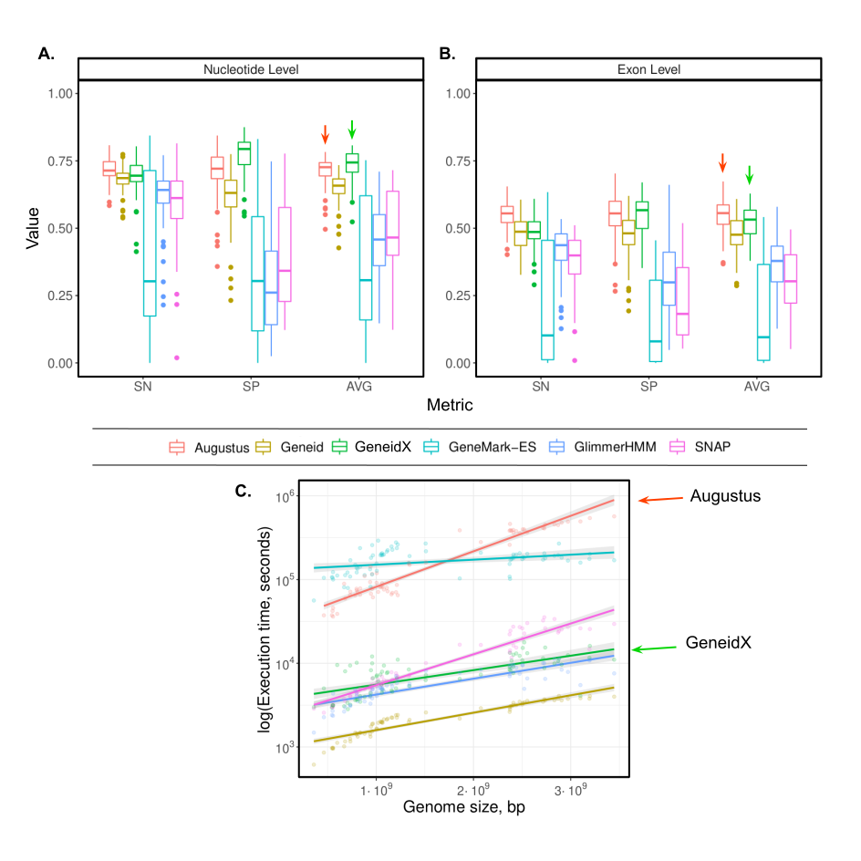
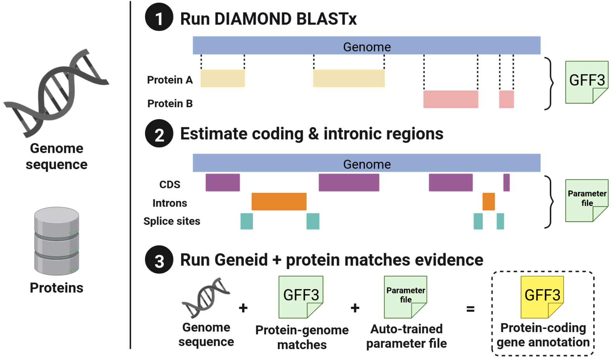

# GeneidX

GeneidX provides a fast annotation of the protein-coding genes in an eukaryotic genome taking as input the genome assembly and the taxonomic ID of the species to annotate.

In the description here, you can find our preliminary results, a schema of our method and a description of the minimal requirements and commands required for running it.

Stay tuned for an article with detailed descriptions and feel free to [contact us](mailto:ferriol.calvet@crg.eu) if you are trying it and find any problem.


## Preliminary results
 The results of an initial benchmarking using vertebrates genomes annotated in Ensembl show that our method is **as accurate as the top *ab initio* gene predictors**, but it is **between 10 and 100 times faster**.
<!--  -->


## Before running GeneidX

### DEPENDENCIES
Make sure ( Docker or Singularity ) and Nextflow are installed in your computer
  - [Docker](https://docs.docker.com/engine/install/)
  - [Singularity](https://sylabs.io/guides/3.0/user-guide/installation.html#)
  - [Nextflow](https://www.nextflow.io/docs/latest/getstarted.html#installation)

### MANDATORY PARAMETERS
Required parameters to run GeneidX

#### tsv
the absolute path of the tsv file input file

> The tsv file can contain multiple assemblies of different species, thus allowing the pipeline to annotate in parallel all the species contained in the tsv file.
See [data/assemblies.tsv](https://github.com/guigolab/geneidx/blob/dev/main/data/assemblies.tsv) for an example.

##### example

| ID    | PATH | TAXID |
| ------- | --- | ------- |
| GCA_951394045.1   | https://www.ebi.ac.uk/ena/browser/api/fasta/GCA_946965045.2?download=true&gzip=true  | 2809013     |
| humanAssembly     | /absolutePath/humanAssembly.fa.gz  | 9606  |

__IMPORTANT__
- the provided paths must point to gzipped files (__.gz__ extension is expected from the pipeline's processes)
- the path can also be a URL

#### column_id_value
the column name of the row id, in the example above is `ID` __it must be unique__

#### column_path_value 
the column name of the path pointing to the fasta file, in the example above is `PATH`

#### column_taxid_value 
the column name of the [taxid](https://www.ncbi.nlm.nih.gov/taxonomy) value, in the example above is `TAXID`

### OPTIONAL PARAMETERS

### use_masking (default = true)
Whether to mask the genomes or not -> boolean

### store_param_files (default=false)
Whether to store the generated geneid param file in the target species folder -> boolean

### assemblies_dir (default="")
Path to the directory where the downloaded assemblies will be stored. In case of many assemblies -> string

### uniref_identity (default= 0.9)
Refers to the level of homology of the proteins taken from UniRef.
Can take values 0.5, 0.9 or 1.0

> Proteins are automatically retrieved from UniRef. See [here](https://www.uniprot.org/help/uniref) for more information.
> The set of proteins in non-redundant considering a more strict or less strict redundancy threshold. (UniRef50, less strict threshold (less proteins, different proteins in this set are really different), > UniRef100 the most strict threshold (more proteins, "more redundant" ))

### proteins_lower_lim (default= 90000)
Ensure that the set of proteins downloaded from UniRef has at least this many proteins.

### proteins_upper_lim (default= 130000)
Ensure that the set of proteins downloaded from UniRef has at most this many proteins.

The downloader module will keep iterating and adjusting the query parameters until the number of proteins is within this range.

### general_gene_params (default= "$projectDir/data/general_gene_model.param")
Template for the basic parameters of the gene structures predicted by geneid. 

### match_score_min (default= 300)
This is the minimal score for a DIAMOND alignment to be used in the process of automatically training the coding potential estimation matrices.

### match_ORF_min (default= 100)
This is the minimal length of a ORF derived from DIAMOND protein alignments to be used in the process of automatically training the coding potential estimation matrices.

### intron_margin (default= 40)
To make sure that what we use as introns is truly non-coding sequence, this is the margin from the end of each predicted exon to the positions where we start assuming that corresponds to an intron.

### min_intron_size (default= 20)
### max_intron_size (default= 10000)
These set the lower and upper boundaries of the size of introns that are being used for building the coding potential estimation matrices.

### source_uniprot (default= 1)
This is a "boolean" variable indicating whether the proteins of input come from uniprot/uniref or not. This information is used for producing a first "functional annotation" of the output GFF3 since it computes the intersection with the file of protein to genome matches in such a way that for each predicted gene we provide a list of which UniRef proteins are highly homologous to it.

## Running GeneidX example:
```
nextflow run guigolab/geneidx -profile <docker/singularity> \
                                        --tsv <PATH_TO_TSV> \
                                        --column_taxid_value <TAXID_COLUMN_NAME> \
                                        --column_path_value <PATH_COLUMN_NAME> \
                                        --column_id_value <ID_COLUMN_NAME> \
                                        --outdir <OUTPUT_directory>
```

or alternatively, clone the repository and then run it (highly recommended)
```
git clone https://github.com/guigolab/geneidx.git
cd geneidx
git checkout dev/v2-fixes
nextflow run main.nf -profile <docker/singularity> \
                              --tsv <PATH_TO_TSV> \
                              --column_taxid_value <TAXID_COLUMN_NAME> \
                              --column_path_value <PATH_COLUMN_NAME> \
                              --column_id_value <ID_COLUMN_NAME> \
                              --outdir <OUTPUT_directory>
```

Revise the DETAILS section below for the minor specifications of each parameter.


## Schema
Which steps are taking place as part of this pipeline?
This is a graphical summary, and the specific steps are outlined below.

1. Get the set of proteins to be used for the protein-to-genome alignments.
2. Get the closest Geneid parameter file to use, as source of the parameters is not indicated by the user.
3. Create the protein database for DIAMOND to use it as a source.
4. Align the provided genome against the database created using DIAMOND BLASTx flavour.
5. Run the auto-training process:
  - Use matches to estimate the coding sections, look for open reading frames between stop codons.
  - Use matches from the same protein to predict the potential introns.
  - From the sequences of both previous steps compute the initial and transition probability matrices required for the computation of the coding potential of the genome that will be annotated.
6. Update the parameter file with the parameters indicated in the *params.config* file and also the matrices automatically generated from the protein-DNA matches.
7. Run Geneid with the new parameter file and the protein-DNA matches from the previous steps as additional evidence.
This is done in parallel for each independent sequence inside the genome FASTA file, and it consists of the following steps:
  - Pre-process the matches to join those that overlap and re-score them appropriately.
  - Run Geneid using the evidence and obtain the GFF3 file.
  - Remove the files from the internal steps.
8. Concatenate all the outputs into a single GFF3 file that is sorted by coordinates.
9. Add information from proteins matching the predicted genes.


## DETAILS:
  - **The name of the sequences in the FASTA file cannot contain unusual characters.**
  - **The input genome file must be a gzip-compressed FASTA file. (.fa.gz)**
  - **Auto-train the parameter file always.**

  - It is recommended to clone the repository and then run the pipeline from there.
  - The output of the predictions is stored in the path indicated when running the pipeline, in the following structure {provided outdir}/species/{taxid of the species}.
  - If you are running the pipeline multiple times, it is recommended that you define a directory for downloading the docker/singularity images to avoid having to download them multiple times. See `singularity.cacheDir variable` in `nextflow.config`.
  - If you have used Geneid in the past and have manually trained a parameter file, we are open to receive them and share them in our repositories giving credit to the users who generated them: to view the complete list of the available parameter files [see](https://github.com/guigolab/geneid-parameter-files)

Contact us at [ferriol.calvet@crg.eu](mailto:ferriol.calvet@crg.eu).


Follow us on Twitter ([@GuigoLab](https://twitter.com/GuigoLab)) for updates in the article describing our method, and contact us for any questions or suggestions.
